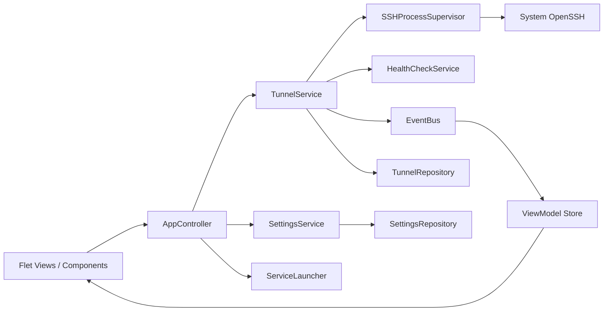
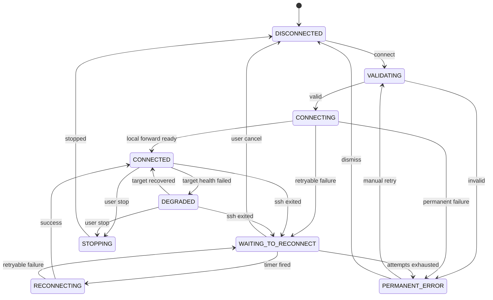

# EasyTunnel 架构演进方案

## 1. 当前架构评估

当前项目已经有基本边界：

- `models.py`：隧道配置、状态、日志快照。
- `config_store.py`：JSON 读取、校验和原子保存。
- `ssh_manager.py`：OpenSSH 参数构建和子进程生命周期。
- `app.py`：Flet 页面、表单、控制逻辑、线程调度和服务启动。

这是合适的 MVP 结构，但下一阶段会遇到以下瓶颈：

1. `app.py` 超过 1000 行，同时承担 View、Controller 和平台操作。
2. UI 每 500 ms 复制全部快照并用指纹判断是否整页重建，日志量增大后成本上升。
3. 日志队列达到 300 条后长度不再变化，当前指纹只看 `len(logs)`，第 301 条以后可能不触发刷新。
4. 刷新循环捕获任何异常后直接退出，一次瞬时错误会让界面永久停止更新。
5. `SSHManager` 使用每进程读取线程、就绪线程和共享锁；继续加入重连、探测、托盘后竞态会迅速增多。
6. 回环地址验证在 UI 和 Manager 中重复，规则以后可能不一致。
7. 配置 schema 有版本字段，但还没有逐版本迁移、恢复模式和文件修订冲突检测。
8. `stop_all()` 逐个停止进程，极端情况下关闭耗时随隧道数量线性增长。

下一阶段不建议整体重写。应通过接口和用例层逐步搬迁，每次重构后保持现有功能及测试可运行。

## 2. 目标分层



职责约束：

- **Domain** 只表达规则和状态，不导入 Flet、subprocess 或 Windows API。
- **Application** 编排“连接、停止、重连、保存”等用例，不直接创建控件。
- **Infrastructure** 封装 OpenSSH、文件、socket、系统托盘和 Windows API。
- **UI** 把用户意图交给 Controller，并按 ViewModel 局部更新。

## 3. 推荐目录结构

```text
easytunnel/
├─ domain/
│  ├─ tunnel.py              # TunnelConfig、ForwardRule、状态
│  ├─ settings.py            # AppSettings、ReconnectPolicy
│  ├─ events.py              # TunnelEvent、错误码
│  └─ validation.py          # 地址、端口、安全规则
├─ application/
│  ├─ tunnel_service.py      # connect/stop/retry/health 用例
│  ├─ settings_service.py
│  ├─ diagnostics_service.py
│  └─ ports.py               # Protocol 接口
├─ infrastructure/
│  ├─ openssh/
│  │  ├─ command_builder.py
│  │  ├─ process_supervisor.py
│  │  └─ error_classifier.py
│  ├─ persistence/
│  │  ├─ json_tunnel_repository.py
│  │  ├─ json_settings_repository.py
│  │  └─ migrations.py
│  ├─ platform/
│  │  ├─ service_launcher.py
│  │  ├─ single_instance.py
│  │  └─ windows_job.py
│  └─ logging/
│     └─ structured_logger.py
├─ ui/
│  ├─ app.py
│  ├─ controller.py
│  ├─ viewmodels.py
│  ├─ components/
│  │  ├─ tunnel_card.py
│  │  └─ status_badge.py
│  └─ views/
│     ├─ tunnels_view.py
│     ├─ logs_view.py
│     ├─ settings_view.py
│     └─ recovery_view.py
└─ __main__.py
```

不需要一次创建所有文件。先抽出无 UI 依赖、可独立测试的部分，再拆控件。

## 4. 核心领域模型

### 4.1 会话与转发规则

当前 `TunnelConfig` 表示一个 SSH 会话，并以不可变元组保存多条 `LocalForward`。每条规则拥有独立名称、服务类型和端点；一个会话只启动一个 SSH 进程并统一启停：

```python
@dataclass(frozen=True, slots=True)
class LocalForward:
    id: str
    name: str
    bind_host: str
    local_port: int
    remote_host: str
    remote_port: int
    service_type: str

@dataclass(slots=True)
class TunnelConfig:
    # SSH 主机、认证和保护参数
    forwards: tuple[LocalForward, ...]
```

配置 schema v2 持久化该结构；schema v1 的顶层单转发字段在加载时迁移为一条 `LocalForward`。未来加入 ProxyJump、`-R` 或 `-D` 时，再进一步拆分 `SSHConnection` 与通用 `ForwardRule`，不把任意 SSH 文本塞回模型。

### 4.2 运行时与配置分离

持久模型不得包含 Popen、PID、线程或最后一次临时错误。运行时建议：

```python
@dataclass(slots=True)
class TunnelRuntime:
    config_id: str
    generation: int
    state: TunnelState
    health: ServiceHealth
    pid: int | None
    attempt: int
    started_at_utc: datetime | None
    next_retry_at_utc: datetime | None
    last_error: TunnelFailure | None
    revision: int
```

`revision` 在状态、PID、健康、错误或日志事件变化时递增。UI 比较 revision，而不是复制全部日志后比较长度。

### 4.3 稳定错误模型

中文文案不能成为业务判断条件：

```python
class FailureCode(str, Enum):
    CONFIG_INVALID = "config_invalid"
    SSH_NOT_FOUND = "ssh_not_found"
    KEY_NOT_FOUND = "key_not_found"
    LOCAL_PORT_IN_USE = "local_port_in_use"
    DNS_FAILED = "dns_failed"
    CONNECTION_TIMEOUT = "connection_timeout"
    CONNECTION_REFUSED = "connection_refused"
    AUTH_FAILED = "auth_failed"
    HOST_KEY_CHANGED = "host_key_changed"
    PROCESS_EXITED = "process_exited"
    STOP_FAILED = "stop_failed"
```

`TunnelFailure` 同时保存稳定错误码、用户文案、可重试性、退出码和经过脱敏的原始信息。重连策略只判断错误码和 `retryable`，不解析中文字符串。

## 5. 状态机

### 5.1 建议状态



服务健康也可独立建模，避免状态组合爆炸。`DEGRADED` 可以是 ViewModel 推导状态，不一定写入 SSH 核心状态。

### 5.2 转移规则

- 只有 `TunnelService` 能改变状态；UI 和输出线程只能发送意图或事件。
- 每次连接生成递增 `generation`/UUID。所有异步结果都携带 generation；不匹配时丢弃。
- 用户停止设置 `desired_state=DISCONNECTED` 并取消重连，再终止进程。
- 正常退出、用户停止和异常退出必须使用不同事件码。
- 状态转移函数应是纯函数并有表驱动测试。

## 6. 进程监管设计

### 6.1 接口注入

定义窄接口以替代测试中直接 monkeypatch 全局函数：

```python
class ProcessRunner(Protocol):
    def spawn(self, args: Sequence[str], options: SpawnOptions) -> ProcessHandle: ...

class PortProbe(Protocol):
    def is_available(self, host: str, port: int) -> bool: ...
    def wait_until_listening(self, host: str, port: int, deadline: float) -> bool: ...

class Clock(Protocol):
    def monotonic(self) -> float: ...
    async def sleep(self, seconds: float) -> None: ...
```

测试使用 FakeProcess、FakeClock 和 ScriptedPortProbe，无需访问私有 `_items` 或真实等待。

### 6.2 并发所有权

推荐由一个 `TunnelService`/Supervisor 任务串行处理每个 tunnel_id 的命令：

```text
UI intent ──> per-tunnel command queue ──> state transition
                                              │
                                  spawn/read/wait/health tasks
                                              │
                          generation-tagged events back to queue
```

这样同一隧道的 start/stop/retry 不需要多个裸线程竞争。不同隧道仍可并发，并设置启动并发上限，例如 4。

如果短期保留线程模型，至少应：

- 保存线程句柄和取消事件。
- `_apply_toggle()` 用 `try/finally` 清理 worker 集合。
- 删除配置时清理目标状态和待执行任务。
- 监控线程异常不能清空仍存活进程的句柄。
- shutdown 并行发送 terminate，然后在统一全局截止时间后 kill。

### 6.3 Windows Job Object

Job Object 适配器属于 infrastructure：

- 主进程启动时创建一个 Job。
- 设置 `JOB_OBJECT_LIMIT_KILL_ON_JOB_CLOSE`。
- 每个 SSH 进程创建后立即加入 Job，再发布“进程已启动”事件。
- 加入失败时停止该进程并把连接视为失败，不能继续无监管运行。
- Job handle 只由应用生命周期根对象持有并在最终退出关闭。

Unix 保持 `start_new_session=True`，使用进程组 SIGTERM/SIGKILL。

## 7. 事件与 UI 更新

### 7.1 事件结构

```python
@dataclass(frozen=True, slots=True)
class TunnelEvent:
    sequence: int
    occurred_at_utc: datetime
    tunnel_id: str
    generation: int
    code: EventCode
    level: LogLevel
    payload: Mapping[str, JsonValue]
```

事件一方面更新 Runtime Store，另一方面写入结构化日志。UI 只消费事件或读取轻量 ViewModel，不读取 Popen。

### 7.2 Flet 更新策略

建议：

- `TunnelCard` 保留实例，并实现 `apply(view_model)` 局部修改文本、颜色和 disabled 状态。
- Controller 用线程安全队列把后台事件转入 Flet 事件循环。
- 100～250 ms 内合并同一隧道的连续日志事件，减少 `page.update()`。
- 日志使用 `ListView`、分页或 `logs_since(sequence)`，不把全部历史复制进普通快照。
- 搜索使用短防抖并只更新列表数据，不重建侧栏和页面根节点。
- 刷新任务仅在 `CancelledError`/页面断开时正常结束；其他异常记录后退避重试并显示诊断提示。

短期兼容修复：给 `_Runtime` 增加单调递增 revision，并把 fingerprint 改为 revision，可先解决 300 条日志后的刷新缺陷。

## 8. 配置存储与迁移

### 8.1 文件布局

```text
%APPDATA%/EasyTunnel/
├─ settings.json
├─ tunnels.json
├─ backups/
│  ├─ tunnels-v1-20260713T120000Z.json
│  └─ ...
└─ known_hosts

%LOCALAPPDATA%/EasyTunnel/
├─ logs/
└─ diagnostics/
```

设置/配置适合漫游数据，日志/临时诊断适合本地数据。私钥永远不复制到上述目录。

### 8.2 加载结果

Repository 不应只返回列表或抛出一个总异常：

```python
T = TypeVar("T")

@dataclass(slots=True)
class LoadResult(Generic[T]):
    items: list[T]
    rejected: list[RejectedRecord]
    warnings: list[LoadWarning]
    source_revision: str
    read_only_recovery: bool
```

这允许“100 条中 1 条损坏时保留其余 99 条”，同时禁止未经确认覆盖原文件。

### 8.3 并发与单实例

- 优先实现应用单实例。
- 文件仍增加 `revision` 或内容哈希；保存时比较加载时 revision，冲突则提示重新加载/另存。
- 迁移前备份、逐版本执行纯函数迁移、完整校验后原子替换。
- 缺失 schema 应视为 legacy v0，而不是假定为当前版本。

## 9. SSH 命令构建演进

保持现有安全原则：参数数组、`shell=False`、不执行用户命令文本。

建议把命令构建器变为纯函数：

```python
def build_ssh_command(
    executable: Path,
    connection: SSHConnection,
    forwards: Sequence[ForwardRule],
    known_hosts: Path,
) -> tuple[str, ...]: ...
```

约束：

- 所有 host、port、username 和路径先通过领域校验。
- 本地/远程绑定默认回环；非回环需要独立授权字段和醒目确认。
- `-L`、`-R`、`-D` 分别构建，不能靠任意文本字段拼接。
- 生产环境默认使用可信的系统 OpenSSH 绝对路径；自定义路径必须是用户明确设置。
- 如果允许 SSH config，作为显式模式建模；不能悄悄改变当前 `-F NUL` 的行为。
- 命令预览从最终参数数组生成，保证与实际启动一致。

## 10. 平台服务启动

把 RDP、Web、TCP 地址处理移出 `app.py`：

```python
class ServiceLauncher(Protocol):
    def describe_action(self, service: ServiceDefinition) -> ActionLabel: ...
    def launch(self, endpoint: LocalEndpoint, service: ServiceDefinition) -> LaunchResult: ...
```

实现仍使用参数列表，不支持任意 Shell 模板。Web 明确建模 scheme/path；RDP 参数使用允许列表；通用 TCP 默认复制地址。这样以后支持 macOS/Linux 时不需要修改 TunnelCard。

“连接并打开”应作为应用用例：记录一次性 `open_when_generation_connected`，仅当对应 generation 成功时执行一次。自动重连和启动时自动连接不能意外重复打开窗口。

## 11. 渐进式重构步骤

### 步骤 1：无行为变化的抽取

- 把地址/端口校验合并到 `domain/validation.py`。
- 抽出 `OpenSSHCommandBuilder` 和 `ServiceLauncher`。
- 给 Runtime 增加 generation、revision。
- 为现有输出建立稳定 FailureCode。

验收：现有自动化测试继续通过，并为抽取接口增加等价测试。

### 步骤 2：Controller 和事件

- 新建 `TunnelService`，UI 不再直接操作 Manager 内部状态。
- 用 `TunnelEvent` 驱动 revision 和结构化日志。
- Card 做局部更新；日志改为增量查询。

验收：301 条日志仍刷新；注入一次 UI 更新异常后可以恢复。

### 步骤 3：可靠性能力

- 新状态机、generation 过滤、自动重连、健康检查。
- shutdown 并行化、Job Object、单实例。
- FakeClock/FakeProcess 覆盖全部竞态。

### 步骤 4：存储和设置

- Repository、AppSettings、备份恢复和 schema 迁移。
- 恢复页与可编辑设置页。

### 步骤 5：高级模型

- 进一步拆分 SSHConnection 与通用 ForwardRule。
- 在迁移测试保护下加入 ProxyJump、`-R`、`-D`；本地多转发已由 `LocalForward` 支持。

## 12. 架构验收指标

- 领域和应用模块可以在未安装 Flet 时导入和测试。
- 进程、时钟、socket、文件和平台 API 均可注入替身。
- 任何异步回调都带 generation，旧回调无法修改新连接。
- 100 条配置、20 条活动隧道、1 万条历史日志下，空闲 CPU 和内存保持稳定。
- 10 个拒绝优雅退出的假进程在统一关闭截止时间内完成清理。
- UI 更新异常、日志写入失败、配置保存失败都可见且不会无声停止核心监管。
- 新功能不需要在 `app.py` 中直接调用 `subprocess`、socket 或文件写入。

## 13. 建议记录的架构决策（ADR）

后续应为以下选择建立短 ADR：

1. 为什么继续使用系统 OpenSSH，而不引入 Paramiko。
2. 为什么默认忽略用户 SSH config，以及何时允许显式开启。
3. 线程监管还是统一 asyncio Supervisor。
4. Windows Job Object 的实现与降级行为。
5. SSHConnection / ForwardRule 的持久模型。
6. known_hosts 的所有权和首次指纹确认流程。
7. 配置备份、迁移和并发修订策略。
8. 正式 Windows 打包技术选型。

ADR 只记录背景、决定、备选和后果，防止未来重复争论同一问题。
