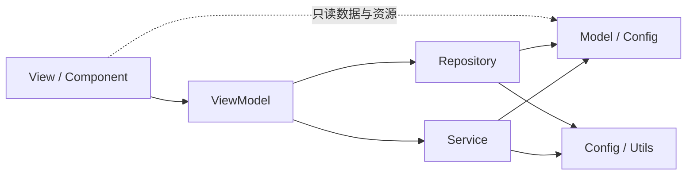

# EasyTunnel MVVM 架构

## 1. 架构目标

EasyTunnel 使用 MVVM（Model-View-ViewModel）组织桌面应用代码。重构遵循
“行为不变、依赖单向、入口兼容”的原则：Flet 控件只存在于 View 和
Component；ViewModel 维护可观察状态并编排用户意图；Repository 和 Service
隔离文件、网络、OpenSSH 与平台能力；Model 只表达业务数据和规则。



依赖必须沿箭头方向流动。View 可只读依赖 Model 和 Config 来构造表单与解析
资源名，但所有持久化、进程、网络和平台操作必须通过 ViewModel；禁止 Model、
Repository 或 Service 反向导入 Flet、View 或 ViewModel。

## 2. 目录结构

```text
EasyTunnel/
├─ easytunnel/
│  ├─ component/
│  │  ├─ dialog/                  # 对话框公共外观和构建器
│  │  └─ widget/                  # 主题、按钮和通用控件
│  ├─ view/
│  │  └─ app_view.py              # Flet 页面与事件绑定
│  ├─ viewmodel/
│  │  ├─ app_viewmodel.py         # 页面状态与应用用例编排
│  │  └─ contracts.py             # Repository/Service 注入协议
│  ├─ model/
│  │  ├─ tunnel.py                # 隧道配置和领域规则
│  │  ├─ runtime.py               # 日志与运行快照
│  │  ├─ ssh_import.py            # SSH 导入 DTO
│  │  └─ update.py                # 更新 DTO 与错误类型
│  ├─ repository/
│  │  ├─ tunnel_repository.py     # JSON 配置持久化
│  │  └─ update_repository.py     # Release 查询、下载与校验
│  ├─ service/
│  │  ├─ ssh_tunnel_service.py    # OpenSSH 生命周期
│  │  ├─ ssh_import_service.py    # 安全命令解析
│  │  ├─ update_service.py        # 更新环境与安装器启动
│  │  └─ platform_service.py      # RDP/Web 平台操作
│  ├─ utils/
│  │  └─ shell.py                 # 纯命令显示工具
│  ├─ config/
│  │  └─ paths.py                 # 应用数据和静态资源路径
│  ├─ app.py                      # 组合根与旧入口兼容门面
│  ├─ models.py                   # 旧模型导入兼容门面
│  ├─ config_store.py             # 旧仓库导入兼容门面
│  ├─ ssh_import.py               # 旧解析器导入兼容门面
│  ├─ ssh_manager.py              # 旧服务导入兼容门面
│  ├─ updater.py                  # 旧更新导入兼容门面
│  ├─ __init__.py
│  └─ __main__.py
├─ assets/
│  ├─ images/                     # 界面图片
│  ├─ icons/                      # SVG/ICO 图标
│  └─ icon.png                    # Flet Windows 构建约定入口
├─ tests/
├─ docs/
├─ scripts/
├─ installer/
├─ main.py
└─ pyproject.toml
```

根目录的 `assets/icon.png` 是 Flet 构建工具的约定文件，因此保留为打包入口；
界面和标题栏代码使用 `images/` 与 `icons/` 下的语义化资源路径。Python wheel
通过 `data-files` 把同一组资源安装到 `share/easytunnel/assets`，命令入口由
`runtime_assets_directory()` 统一定位，避免依赖启动时的工作目录。

## 3. 分层职责

### 3.1 Model

- 定义 `TunnelConfig`、`LocalForward`、`TunnelState`、`RuntimeSnapshot` 和更新 DTO。
- 保存字段级校验、序列化和领域值转换。
- 不导入 Flet，不创建线程，不读写配置文件，不启动进程。

### 3.2 Repository

- `TunnelRepository` 负责配置 schema 迁移、校验和原子 JSON 保存。
- Update Repository 负责 GitHub Release 元数据、安装包和 SHA-256 校验。
- Repository 可以依赖 Model、Config 与 Utils，不能依赖 ViewModel 或 View。

### 3.3 Service

- SSH Service 负责命令构建、子进程、监听就绪、日志和停止行为。
- Import Service 把不可信 SSH 文本解析成结构化 DTO，永不执行文本。
- Update Service 负责运行环境判断和启动已校验安装包。
- Platform Service 封装 RDP 与浏览器启动，View 不直接调用系统 API。

### 3.4 ViewModel

`EasyTunnelViewModel` 是 Flet 无关的应用状态容器，并通过 `contracts.py` 中的
结构化协议接收 Repository/Service，负责：

- 加载、保存、替换和删除隧道配置；
- 导航、搜索、日志筛选与更新状态；
- 对 SSH Service 发送连接/断开意图并合并快速切换；
- 生成运行时指纹并管理应用关闭；
- 通过构造参数接收 Repository 与 Service，便于测试替换。

ViewModel 不创建 `ft.Control`，也不调用 `page.update()`、`page.open()` 或剪贴板。

### 3.5 View 与 Component

- View 构建 Flet 页面，把控件事件转换成普通值并调用 ViewModel。
- Widget 保存主题 token、按钮状态和可复用显示控件。
- Dialog 保存共享浮层样式；对话框生命周期和 FilePicker 仍由 View 管理。
- View 负责 Toast、焦点和页面刷新，不直接读写 JSON 或管理 SSH 进程。

## 4. Composition Root 与依赖注入

`easytunnel/app.py` 是桌面组合根，`create_view_model()` 显式创建生产环境
Repository、Service 和 ViewModel；`EasyTunnelApp` 只负责 Flet 页面，并允许
测试直接注入 ViewModel 替身：

```python
view_model = EasyTunnelViewModel(
    repository=TunnelRepository(config_path, sample_key),
    tunnel_service=SSHTunnelService(),
)
app = EasyTunnelApp(page, view_model=view_model)
```

安装后的 `easytunnel` 命令、`python -m easytunnel` 和根目录 `main.py` 最终都进入
同一个 `main(page)` 函数。

## 5. 主要数据流

### 保存配置

```text
Dialog 输入 -> View 转换为 TunnelConfig -> ViewModel 校验/保存
             -> TunnelRepository 原子写入 -> SSH Service 同步配置
             -> View 关闭 Dialog 并显示反馈
```

### 连接与断开

```text
Switch 事件 -> ViewModel 合并目标状态 -> SSH Service start/stop
             -> RuntimeSnapshot -> View 刷新卡片与日志
```

### 软件更新

```text
View 意图 -> ViewModel 更新 checking/status -> Update Repository 查询
          -> Update Service 启动已校验安装器 -> View 显示 Dialog/Toast
```

## 6. 兼容策略

旧版公开模块至少保留一个发布周期。兼容模块只重导出新模块中的同一对象，不复制
dataclass 或业务实现，确保 `isinstance`、序列化和已有调用保持一致：

```python
from easytunnel.model import TunnelConfig
from easytunnel.models import TunnelConfig as LegacyTunnelConfig

assert TunnelConfig is LegacyTunnelConfig
```

新代码和测试使用 MVVM 目录中的 canonical import；旧模块仅服务外部升级兼容。

## 7. 测试与架构约束

- Model、Repository、Service、ViewModel 各自使用单元测试。
- Flet 视图继续执行递归控件树序列化测试。
- `tests/test_legacy_imports.py` 保证旧、新导入指向相同对象。
- `tests/test_architecture_boundaries.py` 使用 AST 阻止核心层反向依赖 Flet/View。
- 每次迁移必须运行完整 Pytest、Python 编译和 `git diff --check`。

## 8. 后续演进

本轮重构只改变代码组织和依赖所有权，不改变配置 schema、SSH 参数、安全策略或
界面行为。自动重连、事件总线、单实例、Windows Job Object 和增量日志属于后续
功能迭代，应在当前 MVVM 边界内分别扩展 Model、Service 与 ViewModel。
